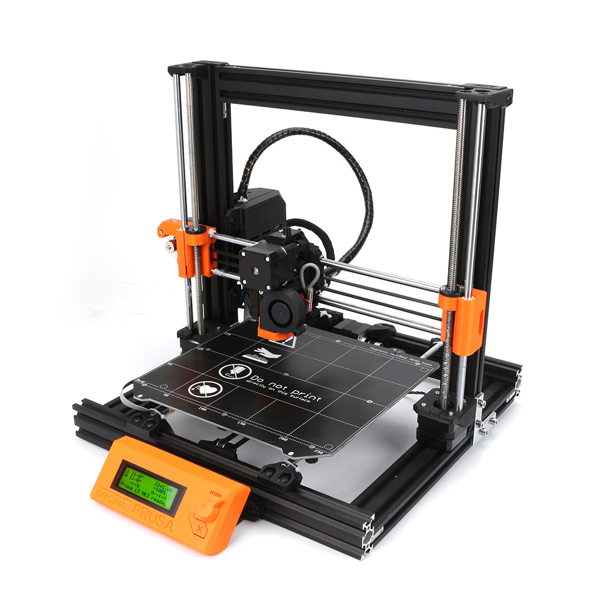

# Prusa-MK3S-Bear-Upgrade-v2.0
Prusa-MK3S-Bear-Upgrade-v2.0 Kit Database

1.Prusa-MK3S-Bear-Upgrade-v2.0 STL file update 2020.7.31
These print files are suitable for Prusa-MK3S-Bear-Upgrade-v2.0 3D printer. Designed by pekcitron.

2.Prusa-MK3S-Bear-Upgrade-v2.0 assembly tutorial  
<https://www.thingiverse.com/thing:2808408>

3.FaceBook Group:
<https://www.facebook.com/groups/238970713918171/>

4.Prusa mini assembly tutorial update 2020.9.4
The tutorial is very detailed. We also provide a video assembly tutorial. It is more convenient to use the two tutorials together，divided into 6 steps:

https://youtu.be/oRfLwulpcgQ

https://youtu.be/KN9BGq8t8Es

https://youtu.be/XHPbWnphqeY

https://youtu.be/lRSTKjYxn9w

https://youtu.be/uE6G7Zj1Ka4

https://youtu.be/oQ1uh0wHKKA

5.Go to buy link：https://www.aliexpress.com/item/33018805883.html?spm=2114.12010615.8148356.3.1fbb3a86kKIB86